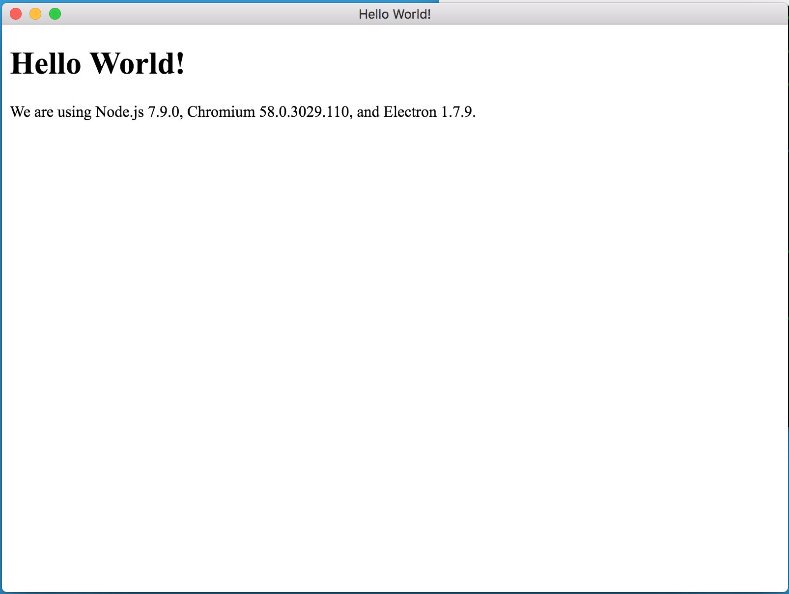
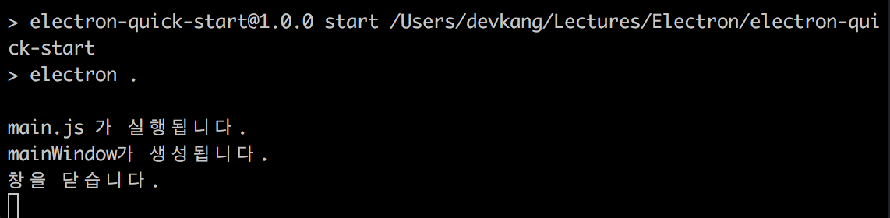
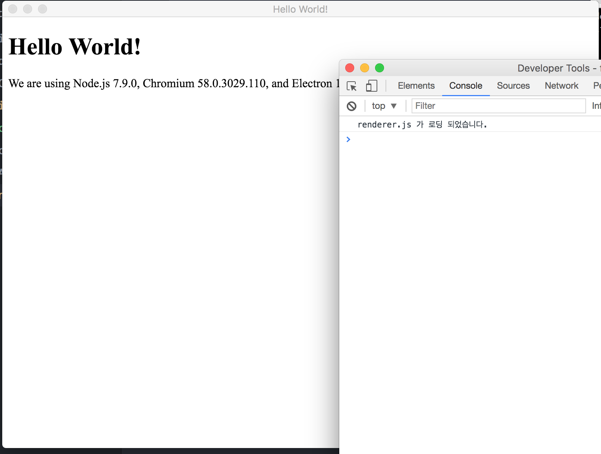

# Electron 의 탄생 배경

Electron은 HTML, CSS, JavaScript를 이용해서 cross-flatform 데스크탑 어플리케이션을 개발할 수 있게 해주는 프레임워크로서, GitHub에서 개발된 오픈소스 프로젝트이다. 공식 문서를 조금 보도록 하자.

> Electron accomplishes this by combining *Chromium* and *Node.js* into a single runtime and apps can be packaged for Mac, Windows, and Linux.

크로미움과 Node.js 를 사용해서 뭔가를 하는가보다. 아직은 어떻게 된다는건지 잘 모르겠으니 우선 Getting Started 부터 해보기로 하자.

## Getting Started
[electron](https://electron.atom.io/) 홈페이지에 들어가서 조금 스크롤을 내리면
[electron-quick-start](https://github.com/electron/electron-quick-start.git) 깃 저장소를 볼 수 있습니다. 이 저장소를 clone 해서 터미널로 이동 후
```
npm install
```
로 package.json 에 기록된 npm 모듈들을 설치 하고
```
npm run start
```
로 실행하면

벌써 데스크탑 앱이 완성되어 있다!!

프로젝트 폴더 안에 있는 index.html 파일을 수정하고 다시 npm run start 를 실행하면 바로 바뀐 화면을 볼 수 있다.

이제 천천히 내부를 보도록 하자.

## Electron의 구조
웹브라우저 엔진인 Chromium을 데스크탑 어플리케이션 프레임워크에 사용하기 위해서 Electron에서는 Chromium의 렌더링 라이브러리 만을 사용한다.(???) 안그래도 파일시스템이나 OS에 대한 접근이 매우 제한적인 웹브라우저에서 그나마 있는 기능들 마저 안쓴다니! 싶겠지만 Electron에서는 그러한 기능들을 모두 Node.js한테 맡겨 버렸다. 쉽게 이야기 하자면 웹앱의 프론트앤드를 Chromium이 담당하고, 백앤드를 Node.js가 담당한다고 보면 되겠다.

이 개념을 공식 문서에서는 *Main Process*(Node.js 담당 - 백앤드)와 *Renderer Process*(Chromium 담당 - 프론트앤드)로 정의하고 있다. 사실 이 개념이 프론트 앤드 - 백앤드 개념과 정확하게 일치하지 않기 때문에 새로운 용어를 정의 하는 것이 어색하지는 않은 듯...

### Main Process
메인 프로세스는 앱의 이벤트 처리, 파일시스템에 대한 접근, 비즈니스 로직 등 앱의 구동에 관련된 일체를 담당한다.

프로젝트 폴더의 package.json 파일을 살펴보자.
```js
{
  // package.json
  // 위에 생략

  "main": "main.js",

  // 아래 생략
}

```
여기서 main.js 가 최초로 진입하는 파일이며, Main Process를 생성하는 파일이다. 이 파일은 얼마든지 바꿀 수 있으니 참고하자.

main.js 파일 상단을 보면
```js
const electron = require('electron')
// Module to control application life.
const app = electron.app
// Module to create native browser window.
```
Electron 앱을 생성한다. 따로 초기화를 해주지 않아도 electron 모듈에서 알아서 해준다. 이 app 변수에
```js
app.on('ready', () => {
    //blah blah ~~
})
```
이렇게 이벤트 리스너를 emit 해줌으로 Main Process를 작성할 수 있다.

앱의 구조가 어떻게 되는지 한번 확인해보기 위해 로그를 추가해보자.

첫번째 로그는 main.js 파일에서 createWindow 함수 바로 위에 추가한다.
```js
// main.js
// ...
// 위에 생략
let mainWindow

console.log('main.js 가 실행됩니다.');

function createWindow () {
    // 아래 생략...
    // ...
}
```


두번째 로그는 main.js 파일에서 createWindow 함수 내부 첫줄에 추가한다.
```js
// main.js
// ...
// 위에 생략
function createWindow () {
  // Create the browser window.
  console.log('mainWindow가 생성됩니다.');

  mainWindow = new BrowserWindow({width: 800, height: 600})

  // 아래 생략
  // ...
}
```

createWindow 함수는 app의 on('ready')에서 이벤트 리스너로 등록되어 있기 때문에 앱이 실행할 준비를 마치면 바로 실행된다.

세번째 로그는 main.js 파일에서 mainWindow.on('closed')의 이벤트 리스너 함수 내부 첫줄에 추가한다.
```js
// main.js
// ...
// 위에 생략
function createWindow () {
  // 위에 생략
  mainWindow.on('closed', function () {
    console.log('창을 닫습니다.');

    mainWindow = null
  })
  // 아래 생략
  // ...
}
```

마지막 로그는 index.html 파일에서 마지막줄에서 포함되는 renderer.js 파일이다.
```js
// This file is required by the index.html file and will
// be executed in the renderer process for that window.
// All of the Node.js APIs are available in this process.
console.log('renderer.js 가 로딩 되었습니다.');
```

여기서 특이한 점은 index.html 의 script 태그에서 commonJS의 요소인 require를 사용해도 별 문제가 없다는 사실이다. 여기서 조금 멘붕이 왔는데, 우선은 main.js 에서 index.html 을 불러와서 renderer process 를 생성한 것이기 때문에 Main Process 에서 사용중인 스크립트를 사용할 수 있다... 정도로 이해하고 있다.

우선 이렇게 로그를 추가한 뒤에 앱 실행 -> 창 닫기를 순서대로 실행한 후에 로그를 살펴보자
우선 터미널의 로그를 보면

이렇게 세 줄의 로그가 보이는데, 이 로그들은 Main Process 에서 발생시킨 로그들이다.

그리고 일렉트론 앱의 개발자 도구에 있는 로그를 살펴보면

이렇게 renderer.js 에서 발생시킨 로그가 담겨온다. 이 로그는 Rendere Process 에서 발생시킨 것이다.

여기까지 간단히 정리 하자면
> 1. Electron 앱이 초기화 되면 package.json의 "main"의 값에 해당하는 경로를 통해 Main Process를 생성한다.
> 2. Main Process 는 각종 이벤트에 대한 리스너를 등록하고 index.html 과 같은 Browser Window 들을 생성하여 화면에 보여준다.
> 3. 각 BrowserWindow 에서는 renderer.js 와 같이 Renderer Process를 생성할 수 있다.

정도...
흥미로운 구석이 많은 프레임 워크다. 계속 공부를 해보자!
