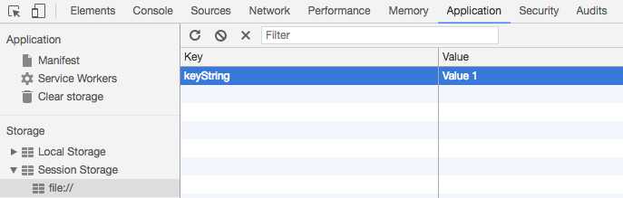

# Session

Electron은 V8엔진을 활용한 브라우저(크로미움) 기반이기 때문에 브라우저에서 가능한 일들은 거의 가능하다. 복잡한 데이터를 사용할 것이 아니라면 cookie, cache, session 도 사용 가능하고, proxy setting 도 가능한데, 이를 담당하는 객체가 Session 이다.

Electron은 기본적으로 Default Session 이라는 세션을 기본으로 제공해준다.
이 세션은 2가지 방법으로 접근할 수 있는데
```js
mainWindow = new BrowserWindow({width: 800, height: 699})
let mainSession = mainWindow.webContents.session
console.log(mainSession)
```
이게 첫번째, 
```js
const { app, BrowserWindow, session } = electron 

function createwindow () {
    // 위에 생략
    let defaultSession = session.defaultSession
    // 아래 생략
}
```
이게 두번째이다.
이 두개가 같은 객체인지 확인하기 위해 
```js
console.log(Object.is(mainSession, defaultSession))
```
이렇게 선언 후 앱을 실행하면
```
Session {} <-- console.log(mainSession) 의 결과
true <-- console.log(Object.is(mainSession, defaultSession)) 의 결과
```
이런 로그가 찍힌다. 아직은 저장한 데이터가 없으니 빈 객체가 들어온다.
크롬의 개발자 도구에서는 세션을 직접 입력할 수 있으니 직접 입력 해보자.

이렇게 저장하고 앱을 재실행 하면
```
Session {}
``` 
(!!!) 세션이 비어있다! defaultSession은 브라우저가 닫히면 지워지는 세션 쿠키와 같이 동작 하는 것 같다.
Browser Window를 2개 선언하고 두개의 webContents.session 을 Object.is()로 비교하면 true로 확인 되고, 개발자 도구에서도 같은 값을 나타낸다.

사실 이번 프로젝트에서는 Realm Database 를 사용할 예정이기 때문에, session 이나 cookie는 거의 사용할 일이 없을것 같긴 하다...